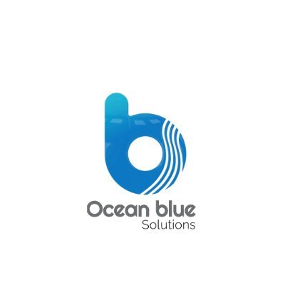

# Ocean Blue Corporation

**One accountable partner for talent, engineering, technology, and operations.**

[Website](https://oceanbluecorp.com) ·
[About](https://oceanbluecorp.com/about) ·
[Solutions](https://oceanbluecorp.com/solutions) ·
[Careers](https://oceanbluecorp.com/careers) ·
[Contact](https://oceanbluecorp.com/contact)

---

## About us

**Ocean Blue Corporation** (legally *Ocean Blue Solutions, Inc.*) is a certified minority- and women-owned enterprise technology partner, founded in **2013** and headquartered in **Powell, Ohio**. We help Fortune 500 enterprises and state government agencies across North America hire the right people, build and modernize their technology, and keep it all running — under a single accountable standard.

We are deliberately built to be **one partner you can hold to the outcome**, not a stack of vendors pointing fingers. From the first conversation to the quarterly review, one team owns the result.

---

## What we do

Four connected practices, one accountable team:

### 🧑‍💻 IT Staffing & Talent

Pre-vetted specialists — cloud, data, security, ERP, Salesforce, and AI engineers — who join your team and deliver from the first sprint. Flexible or permanent hiring, or a fully managed team. Shortlists in 48 hours.

### 🛠️ Engineering Talent & Services

Mechanical, electrical, structural, aerospace, controls, and manufacturing engineers for the industries that build things — automotive, aerospace & defense, power & utilities, manufacturing, and communications.

### ☁️ Enterprise Technology Solutions

Cloud engineering (AWS · Azure · GCP), cybersecurity, ERP (SAP · Oracle · Dynamics), Salesforce, AI & data intelligence, and digital transformation — engineered and shipped without stopping the business.

### 🎧 Managed Services

24/7 monitoring, helpdesk, application and infrastructure support, and continuous optimization — one team, one SLA, one number to call.

---

## Industries we serve

Automotive · Aerospace & Defense · Manufacturing · Power & Utilities · Communications · Healthcare · Financial Services · Government & Public Sector · Retail · Technology

---

## Why Ocean Blue

- **One accountable partner** — a single point of ownership across talent, engineering, technology, and operations.
- **A decade of delivery** — serving enterprises and government agencies since 2013, held to one standard.
- **Fast, curated shortlists** — a pre-vetted network, matched to the role, typically within 48 hours.
- **Supplier-diversity value** — a certified minority- and women-owned business (MBE / WBE, NMSDC).
- **Global delivery** — teams across the **United States · India · United Kingdom**.

---

## Certifications

- Certified **Minority Business Enterprise (MBE)**
- Certified **Women's Business Enterprise (WBE)**
- **NMSDC** member
- Ohio MBE / WBE

---

## Get in touch

|  |  |
| --- | --- |
| 🌐 Website | [oceanbluecorp.com](https://oceanbluecorp.com) |
| 📞 Phone | +1 (614) 844-6925 |
| 📍 Headquarters | 9775 Fairway Drive, Suite C, Powell, OH 43065, USA |
| 💬 Start a conversation | [oceanbluecorp.com/contact](https://oceanbluecorp.com/contact) |
| 💼 Open roles | [oceanbluecorp.com/careers](https://oceanbluecorp.com/careers) |

### Connect with us

[LinkedIn](https://www.linkedin.com/company/ocean-blue-solutions-inc/) ·
[X (Twitter)](https://x.com/OceanBlueSol) ·
[Instagram](https://www.instagram.com/oceanbluesolutions) ·
[YouTube](https://www.youtube.com/@OceanBlueSolutions)

---

© Ocean Blue Corporation · Ocean Blue Solutions, Inc. — Powell, Ohio, USA

<!--
─────────────────────────────────────────────────────────────
For developers: this repository holds the Ocean Blue Corporation
website and internal platform (Next.js 16, React 19, TypeScript,
Tailwind CSS 4, AWS). Setup, architecture, and conventions live in
CLAUDE.md and AWS.md.
─────────────────────────────────────────────────────────────
-->
